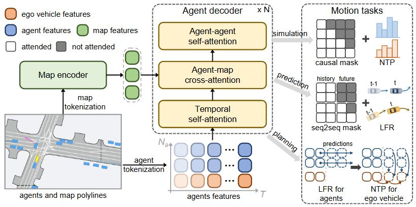

# UniMotion: A Unified Motion Framework for Simulation, Prediction and Planning
### [[Paper]](https://arxiv.org/abs/2510.11092)

> [**UniMotion: A Unified Motion Framework for Simulation, Prediction and Planning**](https://arxiv.org/abs/2510.11092)            
> Nan Song, Junzhe Jiang, Jingyu Li, [Xiatian Zhu](https://scholar.google.com/citations?user=ZbA-z1cAAAAJ&hl=en), [Li Zhang](https://lzrobots.github.io)   
> **NeurIPS 2025**

## Abstract
Motion simulation, prediction and planning are foundational tasks in autonomous driving, each essential for modeling and reasoning about dynamic traffic scenarios. While often addressed in isolation due to their differing objectives, such as generating diverse motion states or estimating optimal trajectories, these tasks inherently depend on shared capabilities: understanding multi-agent interactions, modeling motion behaviors, and reasoning over temporal and spatial dynamics.
Despite this underlying commonality, existing approaches typically adopt specialized model designs, which hinders cross-task generalization and system scalability. More critically, this separation overlooks the potential mutual benefits among tasks. Motivated by these observations, we propose UniMotion, a unified motion framework that captures shared structures across motion tasks while accommodating their individual requirements. Built on a decoder-only Transformer architecture, UniMotion employs dedicated interaction modes and tailored training strategies to simultaneously support these motion tasks. This unified design not only enables joint optimization and representation sharing but also allows for targeted fine-tuning to specialize in individual tasks when needed. Extensive experiments on the Waymo Open Motion Dataset demonstrate that joint training leads to robust generalization and effective task integration. With further fine-tuning, UniMotion achieves state-of-the-art performance across a range of motion tasks, establishing it as a versatile and scalable solution for autonomous driving.

## News
Code is coming soon!

## Pipeline
<div align="center">
  
</div><br/>

## BibTeX
```bibtex
@inproceedings{song2025unimotion,
 title={UniMotion: A Unified Motion Framework for Simulation, Prediction and Planning},
 author={Song, Nan and Jiang, Junzhe and Li, Jingyu and Zhu, Xiatian and Zhang, Li},
 booktitle={NeurIPS},
 year={2025},
}
```

<!--
## Install the environment
The environment is installed following [DiffusionDrive](https://github.com/hustvl/DiffusionDrive), and a reference procedure is provided here.
```
git clone git@github.com:LogosRoboticsGroup/SeerDrive.git

conda env create -f environment.yml
conda activate navsim_seerdrive

git clone git@github.com:motional/nuplan-devkit.git
cd nuplan-devkit/
pip install -e .

cd SeerDrive/
pip install -e .

pip install diffusers einops 
pip install rich==14.0.0
```

## Prepare the data
1. Please follow the official [NAVSIM](https://github.com/autonomousvision/navsim) repository to prepare the dataset.
2. Please follow [WoTE](https://github.com/liyingyanUCAS/WoTE) or use the commands below to preprocess the dataset.
```
python scripts/misc/k_means_trajs.py
bash scripts/misc/gen_pdm_score.sh
bash scripts/evaluation/run_metric_caching.sh
```

## Training and testing
```
# train
bash scripts/training/seerdrive_train.sh

# testing
bash scripts/training/seerdrive_eval.sh
```

## Results and checkpoints
| NC   | DAC  | EP   | TTC  | Comfort | PDMS | Checkpoint |
|:----:|:----:|:----:|:----:|:-------:|:----:|:----------:|
| **98.6** | **97.1** | **82.5** | **95.2** | **100.0**  | **88.9** | [Download](https://drive.google.com/file/d/1CvFsVnMhJCHZ21rTFcOKkgHHrJjteXLb/view?usp=sharing) |


## BibTeX
```bibtex
@inproceedings{zhang2025seerdrive,
 title={Future-Aware End-to-End Driving: Bidirectional Modeling of Trajectory Planning and Scene Evolution},
 author={Zhang, Bozhou and Song, Nan and Li, Jingyu and Zhu, Xiatian and Deng, Jiankang and Zhang, Li},
 booktitle={NeurIPS},
 year={2025},
}
```

## Acknowledgements
- [NAVSIM](https://github.com/autonomousvision/navsim)
- [DiffusionDrive](https://github.com/hustvl/DiffusionDrive)
- [WoTE](https://github.com/liyingyanUCAS/WoTE)
- [SSR](https://github.com/PeidongLi/SSR)